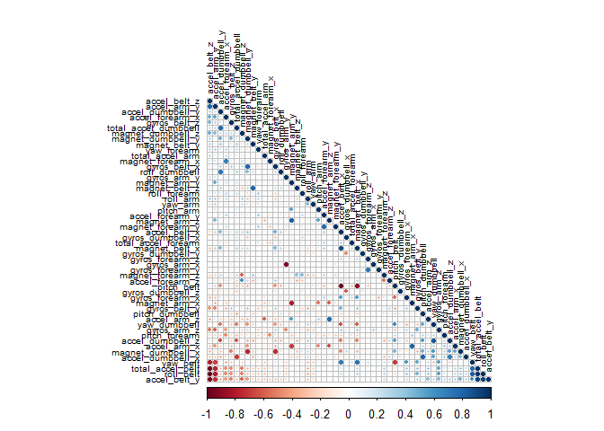
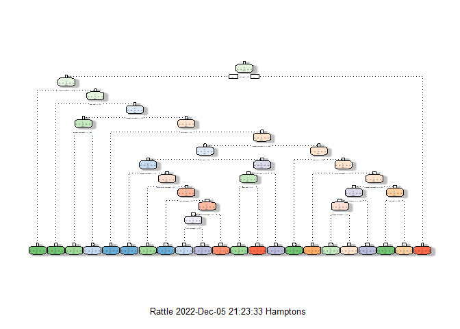

## Background
Using devices such as Jawbone Up, Nike FuelBand, and Fitbit it is now possible to collect a large amount of data about personal activity relatively inexpensively. These type of devices are part of the quantified self movement – a group of enthusiasts who take measurements about themselves regularly to improve their health, to find patterns in their behavior, or because they are tech geeks. One thing that people regularly do is quantify how much of a particular activity they do, but they rarely quantify how well they do it. This project will use data from accelerometers on the belt, forearm, arm, and dumbell of 6 participants and predict the manner in which they performed the activity. 


```r
library(knitr)
library(caret)
```

```
## Warning: package 'caret' was built under R version 4.2.2
```

```r
library(ggplot2)
library(corrplot)
library(lattice)
library(rpart)
library(rpart.plot)
```

```
## Warning: package 'rpart.plot' was built under R version 4.2.2
```

```r
library(rattle)
```

```
## Warning: package 'rattle' was built under R version 4.2.2
```

```r
library(randomForest)
```

```
## Warning: package 'randomForest' was built under R version 4.2.2
```

```r
library(gbm)
```

```
## Warning: package 'gbm' was built under R version 4.2.2
```

```r
library(data.table)
library(plotly)
```

```
## Warning: package 'plotly' was built under R version 4.2.2
```

```r
knitr::opts_chunk$set(echo = TRUE, dev = "png", cache = TRUE)
```

## Load and Read the Data

```r
training <- read.csv("pml-training.csv")
field_data <- read.csv("pml-testing.csv")
dim(training)
```

```
## [1] 19622   160
```

```r
dim(field_data)
```

```
## [1]  20 160
```
Wow! Both data sets contain 160 variables!  The training data set contains 19,622 observations while the field_data set contains 20 observations.  Let's see if we can eliminate any variables that don't contribute to the prediction by cleaning the training data set.

## Cleaning the Data
We'll start by removing columns that do not contain any values.

```r
training <- training[, colSums(is.na(training)) == 0]
dim(training)
```

```
## [1] 19622    93
```
We can continue by eliminating variables that contain personal information and time stamped data that are not accelerometer data.

```r
# Remove variables with time stamps and personal information
classe <- training$classe
training_scrub <- grepl("^X|timestamp|window", names(training))
training <- training[, !training_scrub]
training_assess <- training[, sapply(training, is.numeric)]
training_assess$classe <- classe
dim(training_assess)
```

```
## [1] 19622    53
```
That's a little more manageable!  The training set now only have 53 variables.  We are ready to slice our training data set.

## Slicing the data
We will split the training data set into training (70% of data) and a validation (30% of data) data sets.

```r
inTrain <- createDataPartition(training_assess$classe, p=0.70, list=F)
training_data <- training_assess[inTrain, ]
val_data <- training_assess[-inTrain, ]
dim(training_data)
```

```
## [1] 13737    53
```

```r
dim(val_data)
```

```
## [1] 5885   53
```

A visual representation of variable correlation prior to proceeding to modeling the data.

```r
cp <- cor(training_data[, -length(names(training_data))])
corrplot(cp, order="FPC", method="circle", type="lower",  tl.cex = 0.6, tl.col = rgb(0, 0, 0))
```

<!-- -->


## Data Modeling
We will assess three models to the training data set and the best one relative to the validation data set will be used to predict the activity method for the field_data observations. The three modeling methods are Decision Tree, Generalized Boosted Model, and Random Forests.

### Decision Tree

```r
DTM <- rpart(classe ~ ., data=training_data, method="class")
fancyRpartPlot(DTM)
```

```
## Warning: labs do not fit even at cex 0.15, there may be some overplotting
```

<!-- -->


```r
set.seed(123)
predict_DTM <- predict(DTM, newdata=val_data, type="class")
conf_matrix_DTM <- confusionMatrix(table(predict_DTM, val_data$classe))
conf_matrix_DTM
```

```
## Confusion Matrix and Statistics
## 
##            
## predict_DTM    A    B    C    D    E
##           A 1490  186   39   79   44
##           B   35  688   52   47   56
##           C   28  178  819  199  196
##           D   97   59  105  613   45
##           E   24   28   11   26  741
## 
## Overall Statistics
##                                           
##                Accuracy : 0.7393          
##                  95% CI : (0.7279, 0.7505)
##     No Information Rate : 0.2845          
##     P-Value [Acc > NIR] : < 2.2e-16       
##                                           
##                   Kappa : 0.6695          
##                                           
##  Mcnemar's Test P-Value : < 2.2e-16       
## 
## Statistics by Class:
## 
##                      Class: A Class: B Class: C Class: D Class: E
## Sensitivity            0.8901   0.6040   0.7982   0.6359   0.6848
## Specificity            0.9174   0.9600   0.8763   0.9378   0.9815
## Pos Pred Value         0.8107   0.7836   0.5768   0.6670   0.8928
## Neg Pred Value         0.9545   0.9099   0.9536   0.9293   0.9325
## Prevalence             0.2845   0.1935   0.1743   0.1638   0.1839
## Detection Rate         0.2532   0.1169   0.1392   0.1042   0.1259
## Detection Prevalence   0.3123   0.1492   0.2413   0.1562   0.1410
## Balanced Accuracy      0.9037   0.7820   0.8373   0.7869   0.8332
```

### Generalized Boosted Model

```r
set.seed(123)
GBM <- trainControl(method="repeatedcv", number = 5, repeats = 2)
modfit_GBM <- train(classe ~., method="gbm", data=training_data, verbose=FALSE)

predict_GBM <- predict(modfit_GBM, newdata=val_data)
conf_matrix_GBM <- confusionMatrix(table(predict_GBM, val_data$classe))
conf_matrix_GBM
```

```
## Confusion Matrix and Statistics
## 
##            
## predict_GBM    A    B    C    D    E
##           A 1642   35    0    2    2
##           B   20 1074   36    7   13
##           C    6   28  974   35    9
##           D    2    2   14  911   15
##           E    4    0    2    9 1043
## 
## Overall Statistics
##                                          
##                Accuracy : 0.959          
##                  95% CI : (0.9537, 0.964)
##     No Information Rate : 0.2845         
##     P-Value [Acc > NIR] : < 2.2e-16      
##                                          
##                   Kappa : 0.9482         
##                                          
##  Mcnemar's Test P-Value : 6.134e-06      
## 
## Statistics by Class:
## 
##                      Class: A Class: B Class: C Class: D Class: E
## Sensitivity            0.9809   0.9429   0.9493   0.9450   0.9640
## Specificity            0.9907   0.9840   0.9839   0.9933   0.9969
## Pos Pred Value         0.9768   0.9339   0.9259   0.9650   0.9858
## Neg Pred Value         0.9924   0.9863   0.9892   0.9893   0.9919
## Prevalence             0.2845   0.1935   0.1743   0.1638   0.1839
## Detection Rate         0.2790   0.1825   0.1655   0.1548   0.1772
## Detection Prevalence   0.2856   0.1954   0.1788   0.1604   0.1798
## Balanced Accuracy      0.9858   0.9635   0.9666   0.9692   0.9804
```
### Random Forests

```r
set.seed(123)
RF <- trainControl(method="cv", number=5)
modfit_RF <- train(classe ~ ., data=training_data, method="rf", trControl=RF, ntree=250)
modfit_RF
```

```
## Random Forest 
## 
## 13737 samples
##    52 predictor
##     5 classes: 'A', 'B', 'C', 'D', 'E' 
## 
## No pre-processing
## Resampling: Cross-Validated (5 fold) 
## Summary of sample sizes: 10990, 10990, 10988, 10990, 10990 
## Resampling results across tuning parameters:
## 
##   mtry  Accuracy   Kappa    
##    2    0.9904642  0.9879368
##   27    0.9906102  0.9881213
##   52    0.9814378  0.9765181
## 
## Accuracy was used to select the optimal model using the largest value.
## The final value used for the model was mtry = 27.
```


```r
predictRF <- predict(modfit_RF, val_data)
confusionMatrix(table(val_data$classe, predictRF))
```

```
## Confusion Matrix and Statistics
## 
##    predictRF
##        A    B    C    D    E
##   A 1671    2    0    0    1
##   B   13 1121    5    0    0
##   C    0    6 1015    5    0
##   D    0    0   14  948    2
##   E    0    0    0    5 1077
## 
## Overall Statistics
##                                           
##                Accuracy : 0.991           
##                  95% CI : (0.9882, 0.9932)
##     No Information Rate : 0.2862          
##     P-Value [Acc > NIR] : < 2.2e-16       
##                                           
##                   Kappa : 0.9886          
##                                           
##  Mcnemar's Test P-Value : NA              
## 
## Statistics by Class:
## 
##                      Class: A Class: B Class: C Class: D Class: E
## Sensitivity            0.9923   0.9929   0.9816   0.9896   0.9972
## Specificity            0.9993   0.9962   0.9977   0.9968   0.9990
## Pos Pred Value         0.9982   0.9842   0.9893   0.9834   0.9954
## Neg Pred Value         0.9969   0.9983   0.9961   0.9980   0.9994
## Prevalence             0.2862   0.1918   0.1757   0.1628   0.1835
## Detection Rate         0.2839   0.1905   0.1725   0.1611   0.1830
## Detection Prevalence   0.2845   0.1935   0.1743   0.1638   0.1839
## Balanced Accuracy      0.9958   0.9946   0.9897   0.9932   0.9981
```


## Prediction on the Field_Data Set
Accuracy of the models were,
Decision Tree: 73.93%;
Generalized Boosted Model: 95.90%; and,
Random Forests: 99.10%


```r
predict <- factor(predictRF) 
classe <- factor(val_data$classe)
accuracy <- postResample(predict, classe)
accuracy[1]
```

```
##  Accuracy 
## 0.9909941
```

```r
oose <- 1-accuracy[1]
oose
```

```
##    Accuracy 
## 0.009005947
```
As the Random Forest model was the most accurate, with an accuracy of **0.9910** and an out-of-sample error of **0.0090**, applying it to the Field_Data set yields:

```r
result <- predict(modfit_RF, field_data[, -length(names(field_data))])
result
```

```
##  [1] B A B A A E D B A A B C B A E E A B B B
## Levels: A B C D E
```


