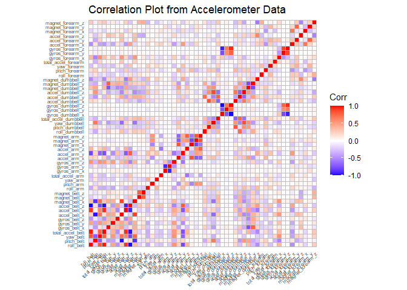
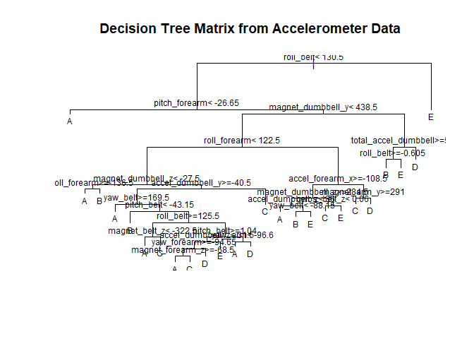

## Background
Using devices such as Jawbone Up, Nike FuelBand, and Fitbit it is now possible to collect a large amount of data about personal activity relatively inexpensively. These type of devices are part of the quantified self movement – a group of enthusiasts who take measurements about themselves regularly to improve their health, to find patterns in their behavior, or because they are tech geeks. One thing that people regularly do is quantify how much of a particular activity they do, but they rarely quantify how well they do it. This project will use data from accelerometers on the belt, forearm, arm, and dumbell of 6 participants and predict the manner in which they performed the activity. 


```r
library(knitr)
library(caret)
```

```
## Warning: package 'caret' was built under R version 4.2.2
```

```r
library(rpart)
library(rpart.plot)
```

```
## Warning: package 'rpart.plot' was built under R version 4.2.2
```

```r
library(randomForest)
```

```
## Warning: package 'randomForest' was built under R version 4.2.2
```

```r
library(ggcorrplot)
```

```
## Warning: package 'ggcorrplot' was built under R version 4.2.2
```

```r
knitr::opts_chunk$set(echo = TRUE, dev = "png", cache = TRUE)
```

## Load and Read the Data

```r
training <- read.csv("pml-training.csv")
testing <- read.csv("pml-testing.csv")
dim(training)
```

```
## [1] 19622   160
```

```r
dim(testing)
```

```
## [1]  20 160
```
Wow! Both data sets contain 160 variables!  The training data set contains 19,622 observations while the testing set contains 20 observations.  Let's see if we can eliminate any variables that don't contribute to the prediction.

## Cleaning the Data
We'll start by removing columns that do not contain any values.

```r
training <- training[, colSums(is.na(training)) == 0]
testing <- testing[, colSums(is.na(testing)) == 0]
```
Now we will eliminate variables that do not appear to contribute to the accelerometer inputs.

```r
classe <- training$classe
training_scrub <- grepl("^X|timestamp|window", names(training))
training <- training[, !training_scrub]
training_assess <- training[, sapply(training, is.numeric)]
training_assess$classe <- classe
testing_scrub <- grepl("^X|timestamp|window", names(testing))
testing <- testing[, !testing_scrub]
testing_assess <- testing[, sapply(testing, is.numeric)]
dim(training_assess)
```

```
## [1] 19622    53
```

```r
dim(testing_assess)
```

```
## [1] 20 53
```
That's a little more manageable!  Both data sets now only have 53 variables.  Now we are ready to slice our training data set.

## Slicing the data
We will split the training_assess data set into a training data set and a validation data set.

```r
set.seed(123) 
inTrain <- createDataPartition(training_assess$classe, p=0.70, list=F)
training_data <- training_assess[inTrain, ]
val_data <- training_assess[-inTrain, ]
```
## Data Modeling
words go here

```r
controlRf <- trainControl(method="cv", 5)
modelRf <- train(classe ~ ., data=training_data, method="rf", trControl=controlRf, ntree=250)
modelRf
```

```
## Random Forest 
## 
## 13737 samples
##    52 predictor
##     5 classes: 'A', 'B', 'C', 'D', 'E' 
## 
## No pre-processing
## Resampling: Cross-Validated (5 fold) 
## Summary of sample sizes: 10990, 10990, 10989, 10988, 10991 
## Resampling results across tuning parameters:
## 
##   mtry  Accuracy   Kappa    
##    2    0.9914831  0.9892256
##   27    0.9914105  0.9891341
##   52    0.9850040  0.9810288
## 
## Accuracy was used to select the optimal model using the largest value.
## The final value used for the model was mtry = 2.
```
More words about estimating the performance of the model on the validation data set.

```r
predictRf <- predict(modelRf, val_data)
confusionMatrix(table(val_data$classe, predictRf))
```

```
## Confusion Matrix and Statistics
## 
##    predictRf
##        A    B    C    D    E
##   A 1674    0    0    0    0
##   B    6 1129    4    0    0
##   C    0    4 1022    0    0
##   D    0    0   17  946    1
##   E    2    0    6    4 1070
## 
## Overall Statistics
##                                         
##                Accuracy : 0.9925        
##                  95% CI : (0.99, 0.9946)
##     No Information Rate : 0.2858        
##     P-Value [Acc > NIR] : < 2.2e-16     
##                                         
##                   Kappa : 0.9905        
##                                         
##  Mcnemar's Test P-Value : NA            
## 
## Statistics by Class:
## 
##                      Class: A Class: B Class: C Class: D Class: E
## Sensitivity            0.9952   0.9965   0.9743   0.9958   0.9991
## Specificity            1.0000   0.9979   0.9992   0.9964   0.9975
## Pos Pred Value         1.0000   0.9912   0.9961   0.9813   0.9889
## Neg Pred Value         0.9981   0.9992   0.9944   0.9992   0.9998
## Prevalence             0.2858   0.1925   0.1782   0.1614   0.1820
## Detection Rate         0.2845   0.1918   0.1737   0.1607   0.1818
## Detection Prevalence   0.2845   0.1935   0.1743   0.1638   0.1839
## Balanced Accuracy      0.9976   0.9972   0.9867   0.9961   0.9983
```

```r
predict <- factor(predictRf) 
classe <- factor(val_data$classe)
accuracy <- postResample(predict, classe)
accuracy
```

```
##  Accuracy     Kappa 
## 0.9925234 0.9905414
```

```r
1-accuracy[1]
```

```
##    Accuracy 
## 0.007476636
```
Words about accuracy and out-of-sample error.

## Predicting on the Test Data Set

```r
result <- predict(modelRf, testing_assess[, -length(names(testing_assess))])
result
```

```
##  [1] B A B A A E D B A A B C B A E E A B B B
## Levels: A B C D E
```
And finally a correlation plot and a decision tree matrix.

```r
cp <- cor(training_data[, -length(names(training_data))])
ggcorrplot(cp, title="Correlation Plot from Accelerometer Data", tl.cex=6)
```

<!-- -->


```r
DTM <- rpart(classe ~ ., data=training_data, method="class")
plot(DTM, main="Decision Tree Matrix from Accelerometer Data")
text(DTM, cex=0.75)
```

<!-- -->


